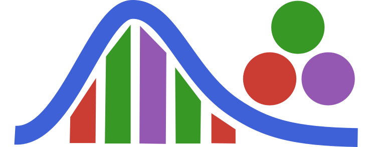

# WaveSpec.jl

<p align="left">
  
</p>

[](https://CMOE-TUDelft.github.io/WaveSpec.jl/stable/)
[](https://CMOE-TUDelft.github.io/WaveSpec.jl/dev/)
[](https://github.com/CMOE-TUDelft/WaveSpec.jl/actions/workflows/CI.yml?query=branch%3Amain)
[](https://codecov.io/gh/CMOE-TUDelft/WaveSpec.jl)

## Description

**WaveSpec.jl** is a Julia package for generating stochastic sea states using Airy wave theory, widely used in numerical ocean modeling and hydrodynamics. It provides a modular framework for defining, discretizing, and simulating ocean wave spectra.

The package allows users to:
1. Define **continuous wave spectra** (e.g., JONSWAP, TMA, Bretschneider).
2. Choose **sampling strategies** (e.g., Uniform, Logarithmic, Chebyshev) in either frequency or energy domains.
3. Apply **angular spreading** models (e.g., Cosine-Power, Von Mises).
4. Generate **Airy wave states** (amplitude, phase, frequency, direction) for time-domain reconstruction.

## Key Features

### Continuous Spectrums
Pre-defined spectral models with adjustable parameters:
- `JONSWAP`
- `TMA` (Finite depth)
- `Bretschneider`
- `Donelan`
- `OchiHubble` (Multi-modal)

### Discretization & Sampling
Flexible discretization of continuous spectra:
- **Domains**: Frequency Domain (`Frequency`), Energy Domain (`Energy`).
- **Methods**: `UniformSampling`, `LogSampling`, `ChebyshevSampling`.
- `DiscreteSpectralSpreading`: Converts a continuous spectrum into discrete frequency bands.

### Angular Spreading
Directional spreading models for realistic 3D seas:
- `CosinePowerDistribution`
- `VonMisesDistribution`
- `DonelanBannerDistribution`
- `DiscreteAngularSpreading`: Discretize directionality with a specified number of angles.

### Wave Generation
- `AiryState`: Combines spectral and angular information into a complete sea state description.
- `generate_sea`: Generates time-series data using linear wave theory (Airy waves).

## Installation

```julia
using Pkg
Pkg.add("WaveSpec")
```

## Basic Usage

Here is a simple example of how to generate a classic JONSWAP sea state:

```julia
using WaveSpec

# 1. Define a JONSWAP spectrum
Hs = 2.5  # Significant wave height [m]
Tp = 8.0  # Peak period [s]
spec = WaveSpec.ContinuousSpectrums.JONSWAP(
    Hs,
    Tp
)

# 2. Discretize the spectrum
# DiscreteSpectralSpreading(shape, strategy, fmin, fmax, nf; domain=Frequency)
discrete_spec = WaveSpec.SpectralSpreading.DiscreteSpectralSpreading(
    spec,
    WaveSpec.SpectralSampling.LogSampling(),         # Sampling strategy
    0.05,                                            # fmin [Hz]
    1.0,                                             # fmax [Hz]
    50;                                              # Number of frequencies
    domain = WaveSpec.SpectralSampling.Frequency     # Sampling domain
)

# 3. Define Angular Spreading
# DiscreteAngularSpreading(dist::UnivariateDistribution, a::Real, b::Real, nθ::Int; units=:radians)
# Cosine-Power distribution centered at 0 radians with power exponent 2, truncated between -π/2 and π/2
angle_dist = WaveSpec.AngularSpreading.CosinePowerDistribution(0.0, 2.0)
discrete_angle = WaveSpec.AngularSpreading.DiscreteAngularSpreading(
    angle_dist,
    -π/2,
    π/2,
    36  # 36 discrete angles
)


# 4. Generate the Sea State
depth = 50.0 # Water depth [m]
sea_state = WaveSpec.AiryWaves.AiryState(
  discrete_spec,
  discrete_angle,
  depth
)

# 5. Access wave components
# sea_state.ω (frequencies), sea_state.k (wavenumbers), sea_state.θ¸ (angles)
```

## Documentation

For full documentation, please visit the [documentation website](https://CMOE-TUDelft.github.io/WaveSpec.jl/dev/).

## Contact

Please contact the main developers [Shagun Agarwal](https://shagun751.github.io/), [Pau Manyer]() or [Oriol Colomés](https://www.tudelft.nl/en/staff/j.o.colomesgene/?cHash=d85db1dfc98f5e255324852d31948ede) for further questions.

